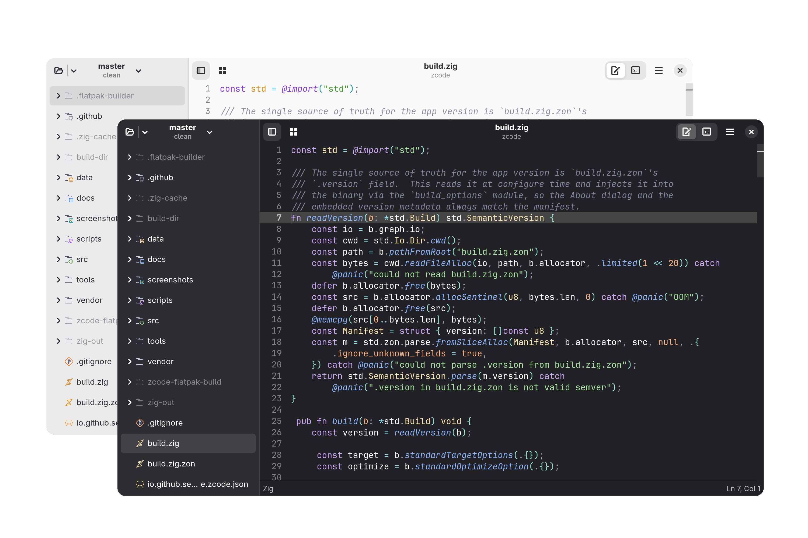
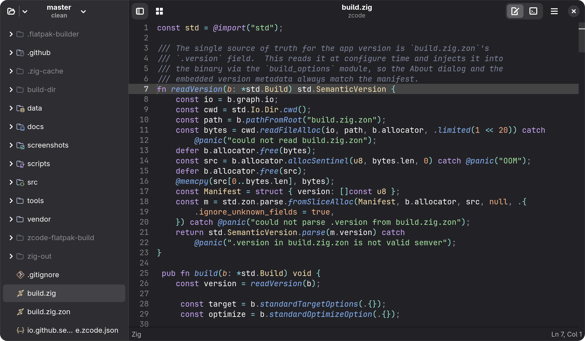
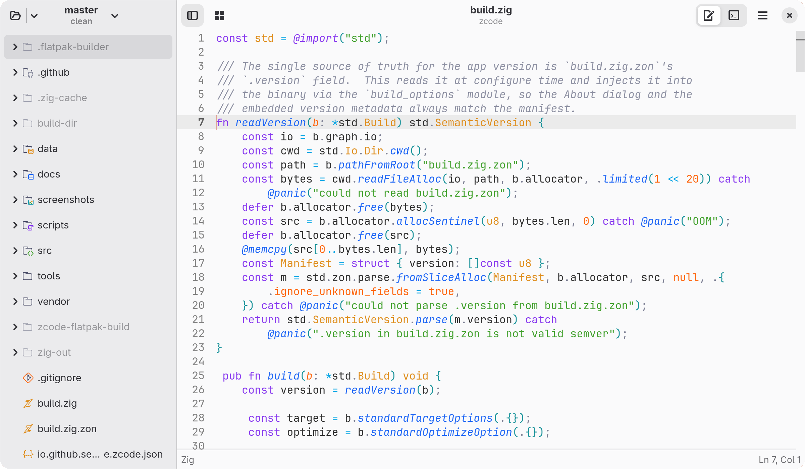

<div align="center">
  

  # Zcode

  **A simple and native code editor for Gnome built in Zig.**

  [](https://ziglang.org)
  [](https://tree-sitter.github.io/tree-sitter/)
  [](https://opensource.org/license/mit)
  [](https://github.com/senonide/zcode/actions/workflows/ci.yml)
  [](https://github.com/senonide/zcode/actions/workflows/release.yml)

  <p align="center">
    
  </p>

</div>

## About

Zcode is a small, fast code editor for the Gnome desktop, written in Zig on
top of GTK 4, libadwaita, GtkSourceView 5 and VTE, with a thin C layer for the
GObject-heavy bits that don't translate cleanly to Zig. It aims to stay simple
and native: one well-built editor pane, a collapsible project sidebar, an
integrated terminal and language-server features, all following the Gnome
Human Interface Guidelines.

## Features

- **Syntax highlighting** — tree-sitter for Zig, Go, Rust, C, Python,
  JavaScript, TypeScript, TSX and Markdown, with incremental parsing and
  viewport-limited tagging for large files; GtkSourceView's native highlighter
  covers everything else.
- **Language servers** — LSP-backed completion, hover, go-to-definition,
  signature help, diagnostics, document formatting and code actions. Servers
  are spawned lazily per project and language (zls, gopls, rust-analyzer,
  clangd, pyright, typescript-language-server).
- **Editor** — find & replace (case, word, regex), quick open (Ctrl+P) with
  subsequence matching, go-to-line, configurable indentation, line numbers,
  word wrap and right-margin guide.
- **Git integration** — change bars in the gutter vs HEAD, added/removed line
  counts in the status bar, branch switching from the sidebar header.
- **Integrated terminal** — VTE with multiple tabs, following the system
  light/dark style.
- **Markdown & HTML preview** — live preview pane via WebKitGTK and cmark,
  with in-editor link handling.
- **Image viewing** — PNG, JPEG, SVG and other image formats open directly in
  a tab.

## Screenshots

| Dark | Light |
|------|-------|
|  |  |

## Build

Zcode is Flatpak-first. A local binary build is useful for development and
debugging.

### Flatpak

1. Install `flatpak` and `flatpak-builder` (or the `org.flatpak.Builder`
   Flatpak app).
2. Run the build script:

   ```sh
   ./scripts/build-flatpak.sh --install --run
   ```

   This pulls the GNOME runtime/SDK from Flathub, builds the bundled
   dependencies (cmark, VTE, the Zig toolchain) and Zcode itself, installs it
   and runs it. Use `--bundle` to export a single-file `.flatpak` bundle
   instead.

### Local binary (debugging)

Zcode links against GTK 4, libadwaita, GtkSourceView 5, VTE, WebKitGTK 6 and
libcmark. On Fedora, install the development headers first:

```sh
sudo dnf install gtk4-devel libadwaita-devel gtksourceview5-devel \
                 vte291-gtk4-devel webkitgtk6.0-devel cmark-devel
```

**libadwaita 1.8 or newer is required** (`AdwShortcutsDialog`). Distributions
still on 1.5, Ubuntu 24.04 among them, fail to link with a list of undefined
`adw_*` symbols; build the Flatpak there instead, since its GNOME 50 runtime
carries a new enough libadwaita.

Then build and run with Zig 0.16:

```sh
zig build run
```

The `run` step sets `GSETTINGS_SCHEMA_DIR` so preferences persist without a
system-installed schema. A plain `zig-out/bin/zcode` without that variable
runs without persistence instead of aborting.

Run the tests:

```sh
zig build test
```

## Contributing

Contributions are welcome, see [CONTRIBUTING.md](CONTRIBUTING.md) for the
rules that keep the project simple and maintainable, and how to report bugs.

## Sandbox

Zcode's Flatpak deliberately runs with a wide sandbox, because the features
below only work outside it:

| Permission | Why |
|---|---|
| `--talk-name=org.freedesktop.Flatpak` | The integrated terminal and language servers run on the **host**, not in the sandbox — otherwise your shell, your `PATH` and your toolchains wouldn't be there. |
| `--filesystem=home` | Open and edit projects anywhere under `$HOME`. |
| `--share=network` | Language servers that fetch indexes, and remote images in the Markdown preview. |

In practice this means Zcode can run commands on your host, like any editor
with a built-in terminal. Previews are read-only by design: JavaScript is
disabled for every previewed file, HTML included.

## License

Zcode is released under the [MIT License](LICENSE).

Bundled third-party components (tree-sitter and its grammars, the Catppuccin
icon set, cmark and VTE in the Flatpak) keep their own permissive licences —
see [THIRD-PARTY.md](THIRD-PARTY.md).
